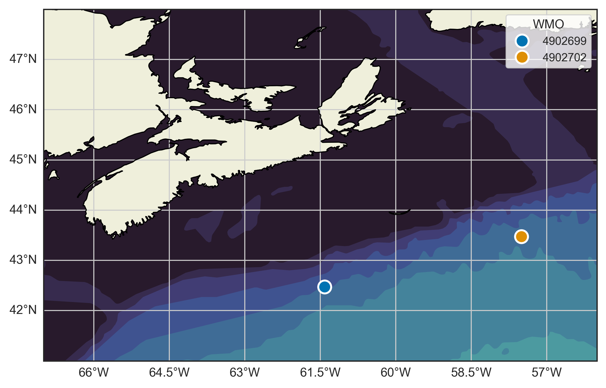
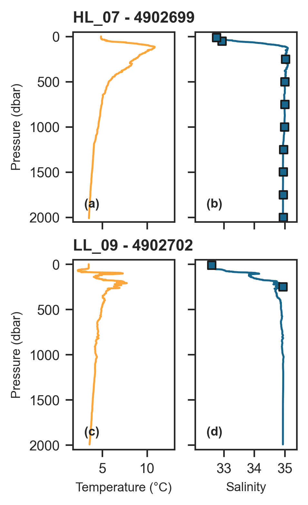

## Argo Floats {#argo-floats}

During the EN728 mission, DFO deployed 2 Argo floats from the RV _Endeavor_ in support of the international [Argo program](https://argo.ucsd.edu/) [@wong2020]. Both floats were NKE ARVOR core float models, which record temperature, conductivity, and depth. The first float was deployed at station HL_07 after completion of the CTD and ring net operations there. The second float was deployed at station LL_09, also following CTD and ring net operations. The location of each deployment can be seen in Figure \@ref(fig:figure2).

Both floats were deployed by hand by two crew using a slip line from the aft starboard deck while the ship was underway doing 1-2 kts. One hour prior to deployment, the floats were pre-tested to confirm establishment of the float's GPS and iridium communications. The floats will remain active for approximately 5 years, collecting vertical profiles from the surface to 2000 m every 10 days. 

The first profile recorded by each float is shown in Figure \@ref(fig:figure3). This profile was collected during ascent of the float, approximately 2 days after deployment. Salinity sensor data from the floats were compared with bottle salinity measurements collected on the CTD casts (up to a depth of 2000 m) from nearby stations HL07 and LL_09 (Figure \@ref(fig:figure3)), and were found to be consistent.

\hspace*{-0.2in}


```{r figure2, include=TRUE, echo=FALSE, out.width="90%", fig.cap="Location of the Argo float deployments conducted during the 2025 spring AZMP survey (EN728). Solid lines show the Argo profile and square markers on the salinity plots represent bottle salinity measurements collected from the CTD-Rosette casts at stations HL_07 and LL_09, and measured using a salinometer."}


```

\clearpage

```{r table6, results="asis", include=TRUE, echo=FALSE}

table6 <- readr::read_csv(file.path('files', "ArgoFloat_DeploymentMetadata_EN728.csv"))
table6_df <- data.frame(table6)
table6_df2 <- table6_df[, c(1:4, 6:8)]
table6_df2$Deployment.Date <- lubridate::parse_date_time(table6_df2$Deployment.Date, c('mdy')) #enter the existing format, which is mm/dd/yyyy

knitr::kable(table6_df2, 
    booktabs = TRUE,
    linesep = "",
    longtable = TRUE,
    # format = "latex",
    escape = TRUE,
    align = "l",
    col.names = c("Station", "Serial No.", "WMO", "Deploy. Date", "Event", "Lat. (DD)", "Lon. (DD)"),
    caption = "Metadata associated with the deployment of two Argo floats during the 2025 spring AZMP survey (EN728). The WMO and serial numbers (S/N) of each float are provided, along with the time of magnet removal and deployment (UTC), and associated date, event, station, and latitude and longitude (in decimal degrees) of deployment.") %>%
    kableExtra::row_spec(c(0), bold = TRUE, font_size = 11) %>%
    kableExtra::row_spec(c(1,2), font_size = 10) %>%
    kableExtra::column_spec(1, width = "3em") %>%
    kableExtra::column_spec(2, width = "10em") %>%
    kableExtra::column_spec(4, width = "6em") %>%
    kableExtra::column_spec(5, width = "3em") %>%
    kableExtra::column_spec(6, width = "4em") %>%
    kableExtra::column_spec(7, width = "4em")


```


```{r figure3, include=TRUE, echo=FALSE, fig.cap="Initial profile for Argo floats 4902699 and 4902702 deployed at stations HL_07 and LL_09 respectively, during the 2025 spring AZMP mission (EN728)."}

```


\clearpage
