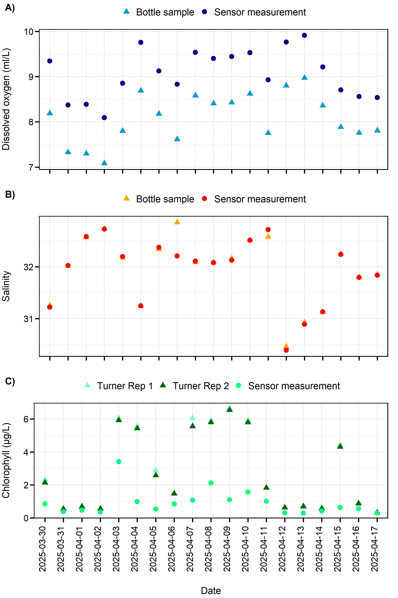

## Flow-Through Systems {#flow}

### TSG system and associated sensors

Continuous surface measurements of temperature, conductivity, salinity, dissolved oxygen, pH, chlorophyll _a_, and coloured dissolved organic matter (CDOM) were collected via a portable flow-through system operated and maintained by BIO's Ocean Engineering and Technology Section (OETS) installed in the Wet Laboratory on the RV _Endeavor_. This system consisted of three tanks which hold a SBE 21 SeaCAT Thermosalinograph (TSG; tank 1), a SBE 18 pH sensor, Aanderaa optode dissolved oxygen sensor, and Seapoint UV CDOM and chlorophyll fluorometers sensors (tank 2), and a General Oceanics pCO$_2$ sensor (tank 3). A debubbler system was installed to reduce air flow through the tanks. This flow-through system was connected to the vessel's uncontaminated science seawater dispersed throughout the vessel via an impeller pump. The seawater intake for this pump was located near the bow of the vessel at 5 m below the sea surface. Temperature at the intake was recorded using an SBE 38 located approximately 12" from the intake. 

On April 6, it was discovered that the impeller pump had been experiencing sporadic shutdowns throughout the mission, which became more persistent. A decision was then made to switch the water source to a second science seawater system on the _Endeavor_ that was modulated via a diaphragm pump. This conversion occurred on April 14. The intake temperature for the impeller pump continued to be fed into the flow-through system. While the intake depth for the diaphragm pump was also 5 m depth, diaphragm pumps are known to produce less shear stress on phytoplankton cells compared to impeller pumps [@Cetinic_2016], potentially resulting in higher-quality optical measurements. However, the diaphragm pump appeared to create pulses in the flow and pressure of water through the flow-through system, potentially impacting other sensor outputs (e.g., dissolved oxygen). Future end users of the chlorophyll data collected on this mission should be aware of compatibility issues of the data collected with the impeller pump system versus the diaphragm pump system.

At approximately 08:12 UTC on Monday April 14, the impeller pump power source failed. This resulted in the loss of data from the intake temperature sensor to the system. Shortly thereafter, a decision was made to connect the temperature sensor located in the ship's transducer well, also located 5 m from the hull of the vessel, to the flow-through system via serial feed. This was used as the intake temperature source for the remainder of the EN728 mission. 

The RV _Endeavor_ also has a shipboard flow-through system installed in the Wet Laboratory on board, which was active during the mission. This system is described further in the [Shipboard Science Systems](#shipboard-systems) section below.


#### Daily underway system sampling

Daily sampling of dissolved oxygen, chlorophyll, salinity, CDOM, and TIC/TA samples were collected from the outflow of the BIO flow-through system throughout the mission (see Table \@ref(tab:table7)). Samples were collected daily at approximately noon, starting on March 30 and ending on April 17. Daily samples were assigned a unique sample ID for each day, which was recorded in the ELOG metadata logger. The sample ID range for daily underway samples collected during the mission was 514003 to 514021. 

\clearpage

\pagestyle{empty} 

```{r table7, results="asis", include=TRUE, echo=FALSE}

table7 <- readr::read_csv(file.path("files", "UnderwaySampleLog_EN728.csv"))
table7_df <- data.frame(table7)
# convert lat column from degrees decimal minutes into decimal degrees
table7_df$Lat <- measurements::conv_unit(table7_df$Lat, from = 'deg_dec_min', to = 'dec_deg') 
table7_df$Lon <- measurements::conv_unit(table7_df$Lon, from = 'deg_dec_min', to = 'dec_deg')
table7_df$Lat <- as.numeric(table7_df$Lat)
table7_df$Lon <- as.numeric(table7_df$Lon)
table7_df$Lon <- table7_df$Lon*(-1)

table7_df$Date <- lubridate::parse_date_time(table7_df$Date, c('mdy')) #enter the existing format, which is mm/dd/yyyy


kbl(table7_df, 
    booktabs = TRUE,
    linesep = "",
    longtable = TRUE,
    format = "latex",
    escape = TRUE,
    align = "l",
    digits = 4, #specifies the maximum number of digits for any numeric column
    col.names = c("Date",	"Time (UTC)",	"Lat. (DD)", "Lon. (DD)", "Temp", "Sal", "Sample ID", "TSG Flow Rate (L/min)",	"pCO2 Flow Rate (L/min)", "pCO2", "TIC/ TA", "Chl", "Salts", "O2", "CM"),
    caption = "Metadata associated with the collection of water samples from the underway system during the 2025 spring AZMP mission (EN728). Date, time (UTC), latitude and longitude (in decimal degrees) of the ship's position were recorded in ELOG at the time of sample entry, while temperature (°C), salinity, and pH were recorded from the thermosalinograph. 'X' and 'XX' indicate single and duplicate sampling, respectively. CM = coloured dissolved organic matter.") %>% 
    kableExtra::row_spec(c(0), bold = TRUE, font_size = 11) %>%
    kableExtra::add_header_above(c(" ", " ", " ", " ", " ", " ", " ", " ", " ", "Bottle Samples" = 6), bold = TRUE, font_size = 12) %>%
    kableExtra::column_spec(2, width = "4em") %>%
    kableExtra::column_spec(3, width = "4em") %>%
    kableExtra::column_spec(4, width = "4em") %>%
    kableExtra::column_spec(7, width = "4em") %>%
    kableExtra::column_spec(8, width = "4em") %>%
    kableExtra::column_spec(9, width = "4em") %>%
    kableExtra::column_spec(10, width = "2em") %>%
    kableExtra::column_spec(11, width = "1.5em") %>%
    kableExtra::column_spec(12, width = "1.5em") %>%
    landscape()
```


\clearpage

\pagestyle{plain} <!-- reinstate for final time in document --> 


#### Data management and sensor validation

The Advanced Serial Data Logger software installed on the BIO flow-through computer system records the TSG, flow rate, NMEA data, and pCO$_2$ RS-232 serial data directly into text (.csv) files produced daily. The frequency of measurements within each file type varies, with NMEA recordings occurring every second, TSG measurements every 5 seconds, and flow data approximately every second. A script was developed using R statistical software to collate the TSG and flow rate data with the corresponding positional data in the NMEA file. Measurements were interpolated in hourly bins and plotted to visualize spatial patterns and help validate the sensor outputs (see Figures \@ref(fig:figure4) and \@ref(fig:figure5) below). The optode calphase output is converted to dissolved oxygen concentration in ml/L whilst correcting for salinity (in the tank) using R.  

As oxygen, chlorophyll and salinity samples taken collected from the outflow from the flow-through system are processed on board, the resulting bottle sample values were plotted against the corresponding flow-through sensor data throughout the mission (see Figure \@ref(fig:figure6)) to validate the sensor outputs. Dissolved oxygen concentration measured by the optode sensor was consistently higher than the corresponding bottle measurements throughout the mission (mean difference = 0.9872 ± 0.1296 ml/L). In contrast, there was relatively good congruence between sensor salinity values and bottle salinity measurements evaluated across the mission (mean difference = -0.0321 ± 0.1551). An exception occurred on April 6, when the daily bottle salinity measurement (32.8583) was nearly 1 unit of measure higher than its corresponding sensor salinity measurement (32.2082). The fluorometer chlorophyll _a_ values were consistently lower than their corresponding Turner chlorophyll _a_ replicates throughout the mission. This pattern was particularly pronounced during periods of higher daily chlorophyll _a_ measurements, and is consistent with the observation of lower CTD fluorometer values relative to the Turner sample values at the depth of the chlorophyll _a_ maximum.
	


### Imaging Flow Cytobot 

As part of a collaborative agreement with the Woods Hole Center for Oceans and Human Health (WHCOHH), an Imaging FlowCytobot (IFCB) was installed in the Special Purpose Laboratory prior to the vessel's departure from Narragansett. This system is designed to draw small seawater samples from its environment (or in this case, from the ship’s science seawater system) every 23 minutes using a syringe pump, which then pushes a thin stream of the sampled water across a microscope objective. Cells and other particles are detected by an in-line laser immediately upstream of the objective. Detections trigger a precisely-timed flash lamp that illuminates the cell/particle just as it passes in front of the microscope objective. Images of cells are captured by a charged-coupled device (CCD) camera and stored in data files that are associated with each seawater sample. Raw data includes gray-scale images of each particle and associated measurements of laser scatter and fluorescence. This system requires a minimum flow rate of 2 L/min, and the total volume sampled is 25 mL per hour. 

The collected images are accessible via an in-house IFCB [dashboard](https://habon-ifcb.whoi.edu/hablab_en728). Due to connectivity issues, IFCB data was not collected while the vessel was sampling the Laurentian Channel Mouth line, but is otherwise available for the entire mission track.

\clearpage


\begin{landscape}

(ref:fig4-caption) Surface temperature ($^\circ$C; top left), salinity (top right), pH (lower left), and the partial pressure of carbon dioxide (pCO$_{2}$; lower right) measured along the cruise track during the 2025 spring AZMP mission (EN728). Data are measured at variable intervals and presented as hourly interpolations.  

```{r figure4, fig.pos = "H", out.height="41%", out.width="47%", fig.align = "center", fig.cap = "(ref:fig4-caption)", fig.show='hold'}

knitr::include_graphics(c("figs/figure4a.png", "figs/figure4b.png", "figs/figure4c.png", "figs/figure4d.png"))

```
\end{landscape}


\pagestyle{plain} <!-- reinstate page style --> 


(ref:fig5-caption) Dissolved oxygen concentration (ml/L; top), chlorophyll fluorescence ($\mu g$/L; middle), and CDOM ($\mu g$/L; bottom) measured along the cruise track during the 2025 spring AZMP mission (EN728). Data are measured at variable intervals and presented as hourly interpolations.  

```{r figure5, fig.pos = "H", out.height="29%", out.width="70%", fig.align = "center", fig.cap = "(ref:fig5-caption)", fig.sep='\\par', out.extra='angle=360', fig.show='hold'}

knitr::include_graphics(c("figs/figure5a.png", "figs/figure5b.png", "figs/figure5c.png"))

```


\clearpage

```{r, include=FALSE}
#could do ```{r figure6, fig.height=12, fig.width=16, echo=FALSE, fig.cap ="(ref:fig6-caption)"}, setting figure width greater than its height...for
#some reason it has to be this way. However, this reduces the resolution, as noted here: https://github.com/kassambara/ggpubr/issues/226.
#Instead, create the plot, export it to the size/quality needed, then import it into Rmarkdown.

TSG_QAT <- readr::read_csv("R:\\SRC\\2020s\\2025\\EN728\\TSG\\compare_CTD_bottle\\bottle\\Bottle_TSG_PCO2_QAT.csv")

TSG_QAT$date_order <- as.character(as.Date(TSG_QAT$POSIXctdate, format = '%m/%d'))


meandiffoxy <- mean(TSG_QAT$oxyTSGmean - TSG_QAT$oxy1, na.rm=TRUE)
sd_oxy <- sd(TSG_QAT$oxyTSGmean - TSG_QAT$oxy1, na.rm=TRUE)

oxyplot <- ggplot()+
  geom_point(data = TSG_QAT, aes(x=date_order, y=oxy1, colour="deepskyblue3"), pch=17, size=3) +
  geom_point(data = TSG_QAT, aes(x=date_order, y=oxyTSGmean, colour="navy"), size=3) +
  scale_color_identity(guide = "legend", name=NULL, labels = c("Bottle sample", "Sensor measurement")) +
  guides(colour = guide_legend(label.theme = element_text(size=14))) +
  theme_bw()+
  ylab("Dissolved oxygen (ml/L)\n") +
  xlab("") +
  theme(legend.position = "top") +
  theme(axis.text.x=element_blank()) +
  theme(plot.margin = unit(c(0.1,0.5,0.1,0.1), "cm")) +
  theme(panel.border = element_rect(colour = "black", fill=NA, linewidth=1)) +
  theme(axis.ticks = element_line(colour = "black", linewidth = 0.8))+
  theme(axis.ticks.length = unit(0.2, "cm"))+
  theme(axis.text = element_text(colour= "black", size=13))+
  theme(axis.title = element_text(size=14)) +
  theme(panel.border = element_rect(colour = "black", fill=NA, linewidth=1)) +
  theme(axis.ticks = element_line(colour = "black", linewidth = 0.8))+
  theme(axis.ticks.length = unit(0.2, "cm"))+
  theme(axis.text = element_text(colour= "black", size=13))+
  theme(axis.title = element_text(size=14)) 


salplot <- ggplot()+
  geom_point(data = TSG_QAT, aes(x=date_order, y=sal, colour="orange"), pch=17, size=3) +
  geom_point(data = TSG_QAT, aes(x=date_order, y=salTSGmean, colour="red"), size=3) +
  scale_color_identity(guide = "legend", name=NULL, labels = c("Bottle sample", "Sensor measurement")) +
  guides(colour = guide_legend(label.theme = element_text(size=14))) +
  theme_bw()+
  ylab("Salinity\n") +
  xlab("") +
  theme(legend.position = "top") +
  theme(axis.text.x=element_blank()) +
  theme(plot.margin = unit(c(0.1,0.5,0.1,0.1), "cm")) +
  theme(panel.border = element_rect(colour = "black", fill=NA, linewidth=1)) +
  theme(axis.ticks = element_line(colour = "black", linewidth = 0.8))+
  theme(axis.ticks.length = unit(0.2, "cm"))+
  theme(axis.text = element_text(colour= "black", size=13))+
  theme(axis.title = element_text(size=14)) +
  theme(panel.border = element_rect(colour = "black", fill=NA, linewidth=1)) +
  theme(axis.ticks = element_line(colour = "black", linewidth = 0.8))+
  theme(axis.ticks.length = unit(0.2, "cm"))+
  theme(axis.text = element_text(colour= "black", size=13))+
  theme(axis.title = element_text(size=14)) 

diff <- mean(TSG_QAT$salTSGmean - TSG_QAT$sal, na.rm=TRUE)
SD <- sd(TSG_QAT$salTSGmean - TSG_QAT$sal, na.rm=TRUE)


chlplot <- ggplot()+
  geom_point(data = TSG_QAT, aes(x=date_order, y=chl1, colour="aquamarine"), pch=17, size=3) +
  geom_point(data = TSG_QAT, aes(x=date_order, y=chl2, colour="darkgreen"), pch=17, size=3) +
  geom_point(data = TSG_QAT, aes(x=date_order, y=chlTSGmean, colour="springgreen"), size=3) +
  scale_color_identity(guide = "legend", name=NULL, labels = c("Turner Rep 1", "Turner Rep 2", "Sensor measurement")) +
  guides(colour = guide_legend(label.theme = element_text(size=14))) +
  theme_bw()+
  ylab("Chlorophyll (\u00b5g/L)\n") +
  xlab("\nDate") +
  theme(legend.position = "top") +
  theme(axis.text.x=element_text(angle=90, vjust=0.05)) +
  theme(plot.margin = unit(c(0.1,0.5,0.1,0.1), "cm"))+
  theme(panel.border = element_rect(colour = "black", fill=NA, linewidth=1)) +
  theme(axis.ticks = element_line(colour = "black", linewidth = 0.8))+
  theme(axis.ticks.length = unit(0.2, "cm"))+
  theme(axis.text = element_text(colour= "black", size=13))+
  theme(axis.title = element_text(size=14)) +
  theme(panel.border = element_rect(colour = "black", fill=NA, linewidth=1)) +
  theme(axis.ticks = element_line(colour = "black", linewidth = 0.8))+
  theme(axis.ticks.length = unit(0.2, "cm"))+
  theme(axis.text = element_text(colour= "black", size=13))+
  theme(axis.title = element_text(size=14)) 
 

png("C:\\AZMP\\1_SPRING_FALL_SURVEYS_FIXEDSTATIONS\\1_BIANNUAL_Surveys\\2025\\SPRING_EN728\\MissionReport\\figs\\figure6.png", width = 8, height = 12, units = 'in', res = 300)
ggarrange(oxyplot, salplot, chlplot, ncol=1, heights = c(1,1,1.2), labels = c('A)', 'B)', 'C)'))
dev.off()

```

(ref:fig6-caption) Comparison between bottle samples and sensor measurements of A) dissolved oxygen, B) salinity and C) chlorophyll collected using BIO's portable flow-through system installed on the RV _Endeavor_ during the 2025 spring AZMP survey.

```{r figure6, out.width = "85%", echo=FALSE, fig.cap ="(ref:fig6-caption)"}



```
\clearpage

