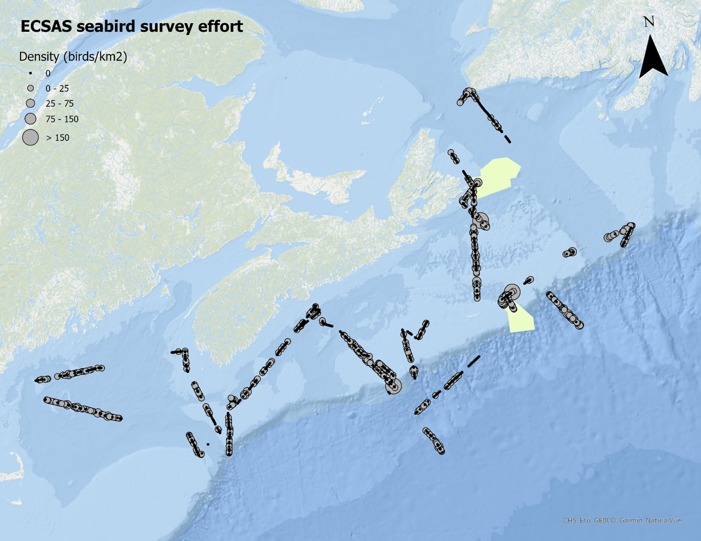

# Seabirds and Marine Mammal Observations

## Background

The east coast of Canada supports millions of breeding marine birds as well as migrants from the southern hemisphere and the eastern North Atlantic. In 2005, the Canadian Wildlife Service (CWS) of Environment Canada initiated the Eastern Canada Seabirds at Sea (ECSAS) program with the goal of identifying and minimizing the impacts of human activities on birds in the marine environment.  Since that time, a scientifically rigorous protocol for collecting data at sea and a sophisticated geodatabase have been developed, relationships with various industries and DFO to support offshore seabird observers have been established, and over 300,000 km of ocean track have been surveyed by CWS-trained observers.  These data are now being used to quantify seabird abundance and distribution at sea and identify and mitigate any threats. In addition, data are collected on marine mammals, sea turtles, sharks, and other marine organisms when they are encountered.


## Methods

Seabird surveys were conducted from the port side of the bridge of the RV _Endeavor_ during the EN728 mission. Surveys were conducted while the ship was moving at speeds greater than 4 knots, looking forward and scanning a 90° arc to one side of the ship. All birds observed on the water within a 300 m-wide transect were recorded, and we used the snapshot approach for flying birds (intermittent sampling based on the speed of the ship) to avoid overestimating abundance of birds flying in and out of transect. Distance sampling methods were incorporated to address the variation in bird detectability. Marine mammal and other marine wildlife observations were also recorded, although surveys were not specifically designed to detect marine mammals.  Details of the methods used can be found in the CWS standardized protocol for pelagic seabird surveys from moving platforms [@Gjerdrum_2012].


## Results

A total of 1636.3 km of ocean was surveyed over 20 days. A total of 2469 marine birds were observed in transect (2786 in total) from 9 families (Table 1). Bird densities averaged 5.3 birds/km2 (ranging from 0 – 449.3 birds/km2). The highest densities of birds (> 150 birds/km2) were observed at the shelf break on the Halifax Line, northeast of the Gully MPA, and the northwestern corner of Misaine Bank (Figure \@ref(fig:figure8)).

Sightings from the family Alcidae were the most abundant (53% of the observations), most of which were Dovekie and Murre. Neither of these species breed in the area, but do spend a significant amount of time there during the non-breeding season. Laridae were also common (34% of the observations), with Black-legged Kittiwake, Herring and Great Black-backed Gulls (Table \@ref(tab:table9)) observed throughout the survey area. An additional 12 terrestrial birds were observed offshore, either migrating overseas or blown off course (Table \@ref(tab:table10)). Only 26 marine mammals were observed during the surveys (Table \@ref(tab:table11)).


## The Gully and St. Ann’s Bank MPAs

Surveys took place in The Gully MPA on April 12 and 14 (see Figure \@ref(fig:figure8)) where a total of 44 marine birds were observed (Table \@ref(tab:table12)). Surveys in St. Ann’s Bank MPA took place on April 7-8, where 172 marine birds were sighting (Table \@ref(tab:table13)). No marine mammals were observed in either of the MPAs.

 
\vspace*{0.2in}

(ref:fig8-caption) Density of birds (all species combined) observed during surveys on the Scotian Shelf AZMP from March 29 to April 17, 2025.

```{r figure8, fig.pos = "H", fig.align = "center", fig.cap = "(ref:fig8-caption)", fig.show='hold'}



```

\clearpage


```{r table9, results="asis", include=TRUE, echo=FALSE}

table9 <- readr::read_csv(file.path("files", "Seabird_Observations_Table9.csv"))
table9_df <- data.frame(table9)
table9_df[is.na(table9_df)] <- ""


kbl(table9_df, 
    booktabs = TRUE,
    linesep = "",
    longtable = TRUE,
    format = "latex",
    escape = TRUE,
    align = "l",
    col.names = c("Family",	"Common Name",	"Latin", "Total No.", "No. Obs. in Transect"),
    caption = "List of marine bird species observed during surveys completed on the EN728 mission from from March 29 to April 17, 2025.") %>%
    kableExtra::row_spec(0, bold = TRUE, font_size = 12) %>%
    kableExtra::row_spec(1, bold = TRUE, italic = TRUE, font_size=11) %>%
    kableExtra::row_spec(32, bold = TRUE, font_size = 11) %>%
  #specify the column widths as table will spill over right margin
    kableExtra::column_spec(3, italic=TRUE, width = "11em") %>%
    kableExtra::column_spec(4, width = "3em") %>%
    kableExtra::column_spec(5, width = "4em") %>%
    kableExtra::kable_styling(latex_options = "repeat_header", repeat_header_method = "replace") 


```

\clearpage


```{r table10, results="asis", include=TRUE, echo=FALSE}

table10 <- readr::read_csv(file.path("files", "Seabird_Observations_Table10.csv"))
table10_df <- data.frame(table10)
table10_df[is.na(table10_df)] <- ""


kbl(table10_df, 
    booktabs = TRUE,
    linesep = "",
    longtable = TRUE,
    format = "latex",
    escape = TRUE,
    align = "l",
    col.names = c("Family",	"Common Name",	"Latin", "Total No."),
    caption = "List of terrestrial bird species observed during surveys completed on the EN728 mission from from March 29 to April 17, 2025.") %>%
    kableExtra::row_spec(0, bold = TRUE, font_size = 12) %>%
    kableExtra::row_spec(1, bold = TRUE, italic=TRUE, font_size = 11) %>%
    kableExtra::row_spec(7, bold = TRUE, font_size = 11) %>%
  #specify the column widths as table will spill over right margin
    kableExtra::column_spec(1, width = "8em") %>%
    kableExtra::column_spec(3, italic=TRUE, width = "10em") %>%
    kableExtra::column_spec(4, width = "3em") %>%
    kableExtra::kable_styling(latex_options = "repeat_header", repeat_header_method = "replace")

```


```{r table11, results="asis", include=TRUE, echo=FALSE}

table11 <- readr::read_csv(file.path("files", "MM_Observations_Table11.csv"))
table11_df <- data.frame(table11)
table11_df[is.na(table11_df)] <- ""


kbl(table11_df, 
    booktabs = TRUE,
    linesep = "",
    longtable = TRUE,
    format = "latex",
    escape = TRUE,
    align = "l",
    col.names = c("Common Name",	"Latin", "Total No."),
    caption = "List of non-avian species observed during surveys completed on the EN728 mission from from March 29 to April 17, 2025.") %>%
    kableExtra::row_spec(0, bold = TRUE, font_size = 12) %>%
    kableExtra::row_spec(1, bold = TRUE, italic=TRUE, font_size = 11) %>%
    kableExtra::row_spec(7, bold = TRUE, font_size = 11) %>%
  #specify the column widths as table will spill over right margin
    kableExtra::column_spec(1, width = "12em") %>%
    kableExtra::column_spec(2, italic=TRUE, width = "9em") %>%
    kableExtra::column_spec(3, width = "4em") %>%
    kableExtra::kable_styling(latex_options = "repeat_header", repeat_header_method = "replace")

```

\clearpage

```{r table12, results="asis", include=TRUE, echo=FALSE}

table12 <- readr::read_csv(file.path("files", "Seabird_Observations_Gully_Table12.csv"))
table12_df <- data.frame(table12)
table12_df[is.na(table12_df)] <- ""


kbl(table12_df, 
    booktabs = TRUE,
    linesep = "",
    longtable = TRUE,
    format = "latex",
    escape = TRUE,
    align = "l",
    col.names = c("Common Name",	"Latin", "Total No."),
    caption = "List of marine bird species observed during surveys within The Gully MPA on April 12 and 14, 2025 during the EN728 mission") %>%
    kableExtra::row_spec(c(0), bold = TRUE, font_size = 12) %>%
    kableExtra::row_spec(10, bold = TRUE, font_size = 11) %>%
  #specify the column widths as table will spill over right margin
    kableExtra::column_spec(1, width = "13em") %>%
    kableExtra::column_spec(2, italic=TRUE, width = "10em") %>%
    kableExtra::column_spec(3, width = "4em") %>%
    kableExtra::kable_styling(latex_options = "repeat_header", repeat_header_method = "replace") 

```

```{r table13, results="asis", include=TRUE, echo=FALSE}

table13 <- readr::read_csv(file.path("files", "Seabird_Observations_StAnns_Table13.csv"))
table13_df <- data.frame(table13)
table13_df[is.na(table13_df)] <- ""


kbl(table13_df, 
    booktabs = TRUE,
    linesep = "",
    longtable = TRUE,
    format = "latex",
    escape = TRUE,
    align = "l",
    col.names = c("Common Name",	"Latin", "Total No."),
    caption = "List of marine bird species observed during surveys within the St. Anns Bank MPA on April 7 and 8, 2025 during the EN728 mission") %>%
    kableExtra::row_spec(c(0), bold = TRUE, font_size = 12) %>%
    kableExtra::row_spec(16, bold = TRUE, font_size = 11) %>%
  #specify the column widths as table will spill over right margin
    kableExtra::column_spec(1, width = "10em") %>%
    kableExtra::column_spec(2, italic=TRUE, width = "10em") %>%
    kableExtra::column_spec(3, width = "4em") %>%
    kableExtra::kable_styling(latex_options = "repeat_header", repeat_header_method = "replace")

```

\clearpage