<!-- The following code should appear at the beginning of the first appendix (if you have one)
After that, all subsequent sections will be turned into appendices. -->

`r if(knitr:::is_latex_output()) '% begin csasdown appendix'`
`r if(!knitr:::is_latex_output()) '# (APPENDIX) Appendix {-}'`

\pagestyle{plain} <!-- reinstate page style --> 


# Vertical Profiles of Temperature, Salinity, Dissolved Oxygen {#appA}

This appendix illustrates the vertical profiles of temperature, salinity, and dissolved oxygen for each station sampled during the EN728 mission. Profile plots are organized by hydrographic section (e.g., Halifax Line). These plots were generated routinely throughout the mission and compared against the corresponding bottle salinity and dissolved oxygen measurements obtained via Winkler titrations as a tool to A) evaluate any discrepancies between the dual sensors, B) evaluate which of the dual sensors more closely reflected the corresponding bottle measurements generated at sea, a task which helps guide the final sensor calibration process, and C) evaluate the laboratory measurements for visual outliers. Outliers in the bottle data were identified based on their divergence from replicate samples, when collected, or whether they fell far from the CTD profile data, and were assigned quality control flags according to the quality control flag schema applied to data submitted in DFO's National Repository, BioChem [@Devine_2014]. 

For the majority of the casts conducted during the mission there was excellent congruence between both the primary and secondary dissolved oxygen and conductivity sensors, and between the sensor and bottle data. Although data from the primary and secondary oxygen sensors were comparable, the secondary sensor was closer to the corresponding Winkler titration values than the primary. 

Although bottle chlorophyll measurements are not used to calibrate the sensor data, they were routinely compared against the chlorophyll fluorometer sensor data throughout the mission to evaluate the reliability of the sensor, and to ensure that all bottle sample IDs for parameters measured at sea were accounted for. The discrepancy between the sensor data and bottle measurements was higher, especially at the depth of the chlorophyll maximum, where the sensors underestimated chlorophyll concentration relative to the bottle measurements. Consequently, outliers were assigned to bottle measurements based only on their deviation from replicate bottle values, and not the sensor data.


```{r include=FALSE}
ctdpath <- '\\\\ent.dfo-mpo.ca/ATLShares/Science/BIODataSvc/SRC/2020s/2025/EN728/CTD_processing/CTD_processing/ODF'
destdir <- 'C:/AZMP/1_SPRING_FALL_SURVEYS_FIXEDSTATIONS/1_BIANNUAL_Surveys/2025/SPRING_EN728/MissionReport/files'
mission <- 'EN728'


###############################################
### Read Downcast CTD Files & Extract Data: ###
###############################################

lst_files <- NULL
ctd_df <- NULL

for (i in 1:length(lst_files)) {
  lst_files<-list.files(path=ctdpath, pattern=paste0('DEN'), full.names = TRUE)
  ctd <- lapply(lst_files, read.ctd.odf)
  
  for(j in 1:length(ctd)){
    data <- ctd[[j]]
    mission <- data.frame(data@metadata$cruiseNumber)
    event <- data.frame(data@metadata$eventNumber)
    station <- data.frame(lapply((data@metadata$header$EVENT_HEADER$STATION_NAME_1), gsub, pattern = "'", replacement = ""))
    longitude <- data.frame(data@metadata$longitude)
    latitude <- data.frame(data@metadata$latitude)
    df <- data.frame(data@data) #extract all data elements
    tmpbind <- cbind(mission, event, station, longitude, latitude, df)
    colnames(tmpbind)[1:5] <- c("mission", "event", "station", "longitude", "latitude")
    ctd_df[[j]] <- tmpbind
    ctd_data <- do.call(rbind.data.frame, ctd_df)
  }
}


save(ctd_data, file = paste(destdir, paste0(mission, '_ctd_data.rda'), sep = '/'))


##################################
### Apply Section Designation: ###
##################################

ctd_data <- ctd_data %>% mutate(Section = case_when(
  grepl("HL", station) ~ "Halifax Line",  #grep returns indices of strings that match a pattern
  grepl("YL", station) ~ "Yarmouth Line",
  grepl("PL", station) ~ "Portsmouth Line",
  grepl("BBL", station) ~ "Browns Bank Line",
  grepl("NEC", station) ~ "Northeast Channel",
  grepl("GUL", station) ~ "Gully",
  grepl("LCM", station) ~ "Laurentian Channel Mouth",
  grepl("LL", station) ~ "Louisbourg Line",
  grepl("STAB", station) ~ "St. Anns Bank",
  grepl("CSL", station) ~ "Cabot Strait Line",
  grepl("SIB", station) ~ "Sable Island Bank"
))


################################################
### Plot Map & Extract CTD Casts by Section: ###
################################################

#Extract coastline:
cad <- ne_countries(country = c("Canada"), scale = "large")

#Convert ctd_data to sf object for easier plotting
ctd_data_sf <- st_as_sf(ctd_data, coords = c("longitude", "latitude"), 
                   crs = 4326, agr = "constant") #WGS84 = CTD code # 4326


#############
### Plots ###
#############

out_dir = "C:/AZMP/1_SPRING_FALL_SURVEYS_FIXEDSTATIONS/1_BIANNUAL_Surveys/2025/SPRING_EN728/MissionReport/figs"
section = unique(ctd_data$Section)


for (i in seq(1, length(section), 1)){
  
section_subset_sf <- (ctd_data_sf[ctd_data_sf$Section %in% section[i],])


map <- ggplot() +
  geom_sf(data = ctd_data_sf, colour="grey80") +
  geom_sf(data = cad, fill = "grey85", col = "grey60", lwd = 0.2) + 
  geom_sf(data = section_subset_sf, aes(fill=station), size=2.5, pch=21) +
  scale_fill_viridis(name="Station", discrete=TRUE) +
  coord_sf(xlim=c(-70,-56), ylim=c(41,48))+#, label_axes = list(left = "N", top = "E")) +
  theme_bw() +
  theme(legend.position = "none") +
  theme(axis.text = element_text(size = 7))  #change size of coord labels


temp <- ggplot() +
  geom_path(data = section_subset_sf, 
  aes(y=pressure, x=temperature, colour=station, group=station), linewidth=1) +
  scale_colour_viridis(name="Station", discrete=TRUE) +
  scale_y_reverse() +
  theme_bw() +
  theme(legend.position = "none") +
  xlab(expression('Temperature ('*degree*C*')')) +
  ylab("Pressure (dbar)") +
  theme(axis.title.y=element_text(size=10)) +
  theme(axis.title.x=element_text(size=10)) 


sal <- ggplot() +
  geom_path(data = section_subset_sf, 
            aes(y=pressure, x=salinity, colour=station, group=station), linewidth=1) +
  scale_colour_viridis(name="Station", discrete=TRUE) +
  scale_y_reverse() +
  theme_bw() +
  theme(legend.position = "none") +
  xlab("Salinity") +
  ylab("Pressure (dbar)") +
  theme(axis.title.y=element_text(size=10)) +
  theme(axis.title.x=element_text(size=10)) 


oxy <- ggplot() +
  geom_path(data = section_subset_sf, 
            aes(y=pressure, x=oxygen, colour=station, group=station), linewidth=1) +
  scale_colour_viridis(name="Station", discrete=TRUE) +
  scale_y_reverse() +
  theme_bw() +
  theme(legend.position = "none") +
  xlab("Oxygen (ml/L)") +
  ylab("Pressure (dbar)") +
  theme(axis.title.y=element_text(size=10)) +
  theme(axis.title.x=element_text(size=10)) 


  png(paste(out_dir, paste0(mission, '_', section[i], '_VerticalProfiles', '.png'), sep='/'), 
      width = 7, height = 6, units = 'in', res = 400)
  plot <- ggarrange(temp, sal, oxy, map, common.legend=TRUE, legend="right")
  print(plot)

dev.off()

}


#You need to change the size of displayed figures by setting the chunk options out.width/out.height. You can set only one of these two options if you want to keep the aspect ratio of the figures.

#fig.width and fig.height affect the physical size of plots that are created using graphical functions such as ggplot(), and these options will not change the display size.
```


```{r figureA1, fig.pos='H', out.width="100%", fig.cap ="Vertical profiles of temperature (top left), salinity (top right), and dissolved oxygen (bottom left) from stations sampled on the Browns Bank Line (BBL; bottom right) during the 2025 spring AZMP mission (EN728)."}

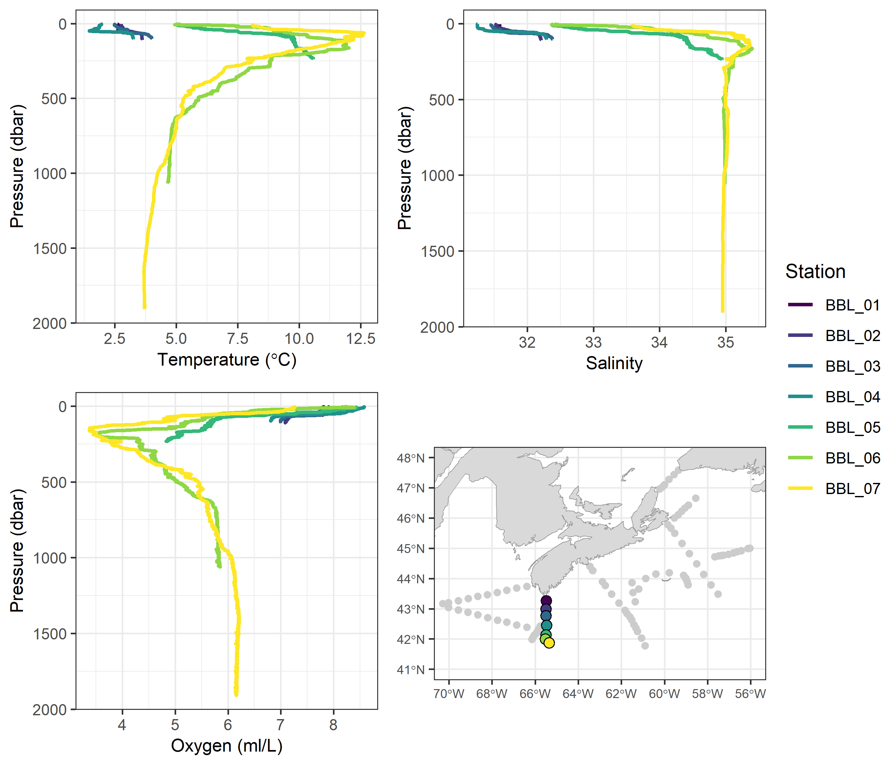

```
\clearpage

```{r figureA2, out.width="100%", fig.cap ="Vertical profiles of temperature (top left), salinity (top right), and dissolved oxygen (bottom left) from stations sampled on the Halifax Line (HL; bottom right) during the 2025 spring AZMP mission (EN728)."}

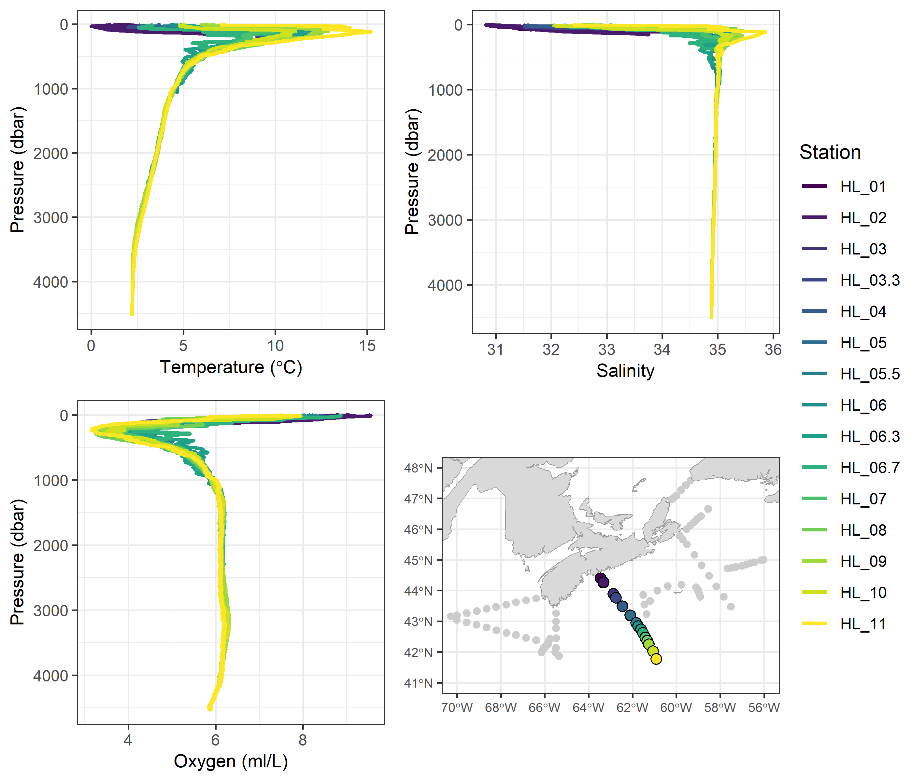

```
\clearpage

```{r figureA3, out.width="100%", fig.cap ="Vertical profiles of temperature (top left), salinity (top right), and dissolved oxygen (bottom left) from stations sampled on the Louisbourg Line (LL; bottom right) during the 2025 spring AZMP mission (EN728)."}

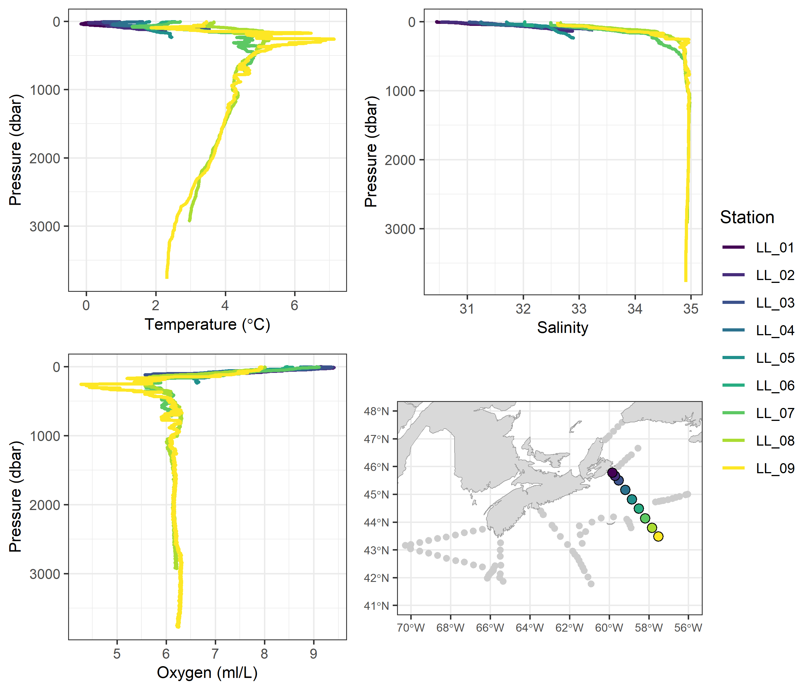

```
\clearpage

```{r figureA4, out.width="100%", fig.cap ="Vertical profiles of temperature (top left), salinity (top right), and dissolved oxygen (bottom rleft) from stations sampled on the Cabot Strait Line (CSL; bottom right) during the 2025 spring AZMP mission (EN728)."}

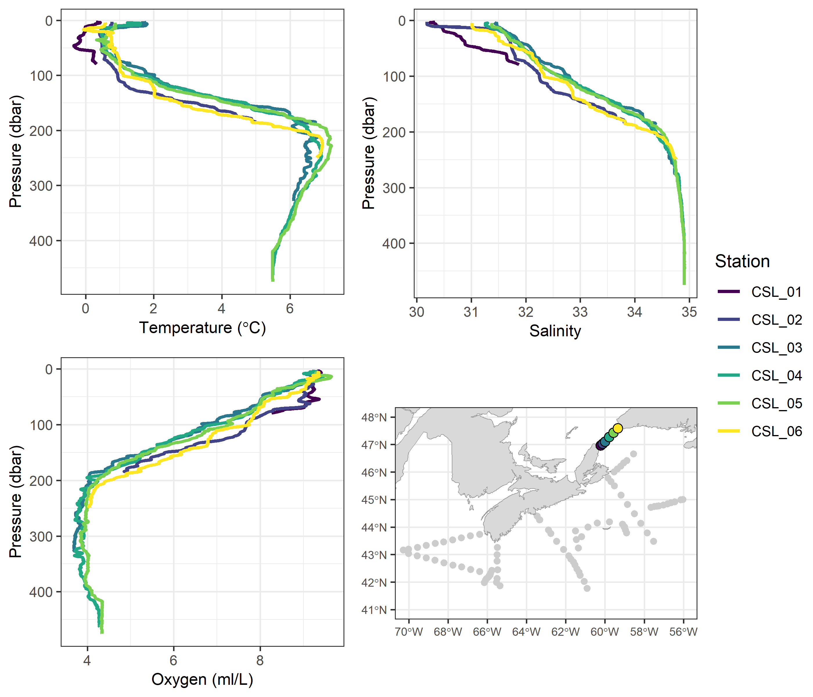

```
\clearpage

```{r figureA5, out.width="100%", fig.cap ="Vertical profiles of temperature (top left), salinity (top right), and dissolved oxygen (bottom left) from stations sampled on the Yarmouth Line (YL; bottom right) during the 2025 spring AZMP mission (EN728)."}

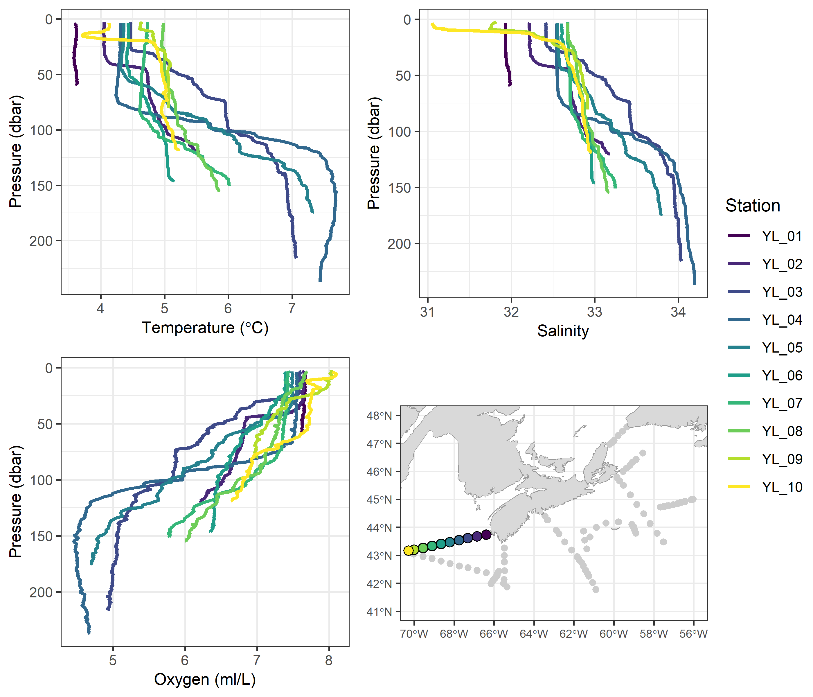

```
\clearpage

```{r figureA6, out.width="100%", fig.cap ="Vertical profiles of temperature (top left), salinity (top right), and dissolved oxygen (bottom left) from stations sampled on the Portsmouth Line (PL; bottom right) during the 2025 spring AZMP mission (EN728)."}

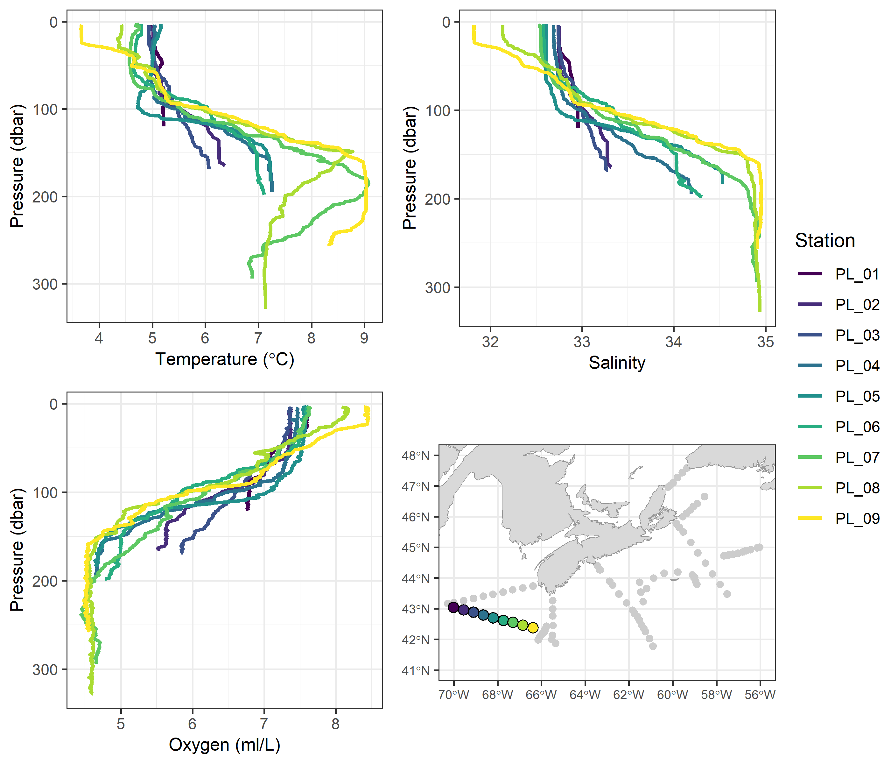

```
\clearpage

```{r figureA7, out.width="100%", fig.cap ="Vertical profiles of temperature (top left), salinity (top right), and dissolved oxygen (bottom left) from stations sampled in the Northeast Channel (NEC; bottom right) during the 2025 spring AZMP mission (EN728)."}

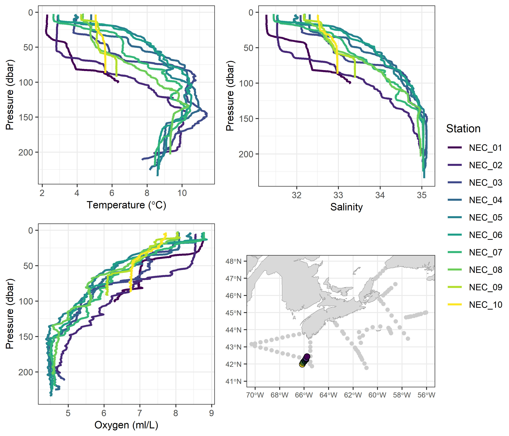

```
\clearpage

```{r figureA8, out.width="100%", fig.cap ="Vertical profiles of temperature (top left), salinity (top right), and dissolved oxygen (bottom left) from stations sampled in the Gully (GUL; bottom right) during the 2025 spring AZMP mission (EN728)."}

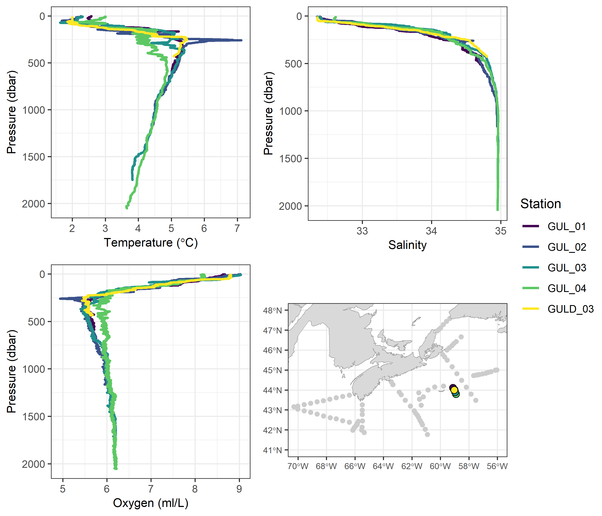

```
\clearpage

```{r figureA9, out.width="100%", fig.cap ="Vertical profiles of temperature (top left), salinity (top right), and dissolved oxygen (bottom left) from stations sampled on St. Anns Bank (STAB; bottom right) during the 2025 spring AZMP mission (EN728)."}

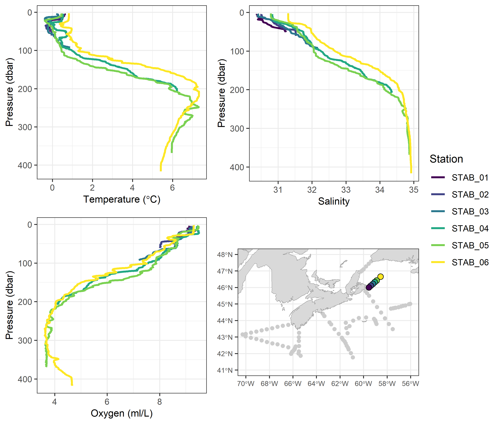

```
\clearpage

```{r figureA10, out.width="100%", fig.cap ="Vertical profiles of temperature (top left), salinity (top right), and dissolved oxygen (bottom left) from stations sampled in the Laurentian Channel Mouth (LCM; bottom right) during the 2025 spring AZMP mission (EN728)."}

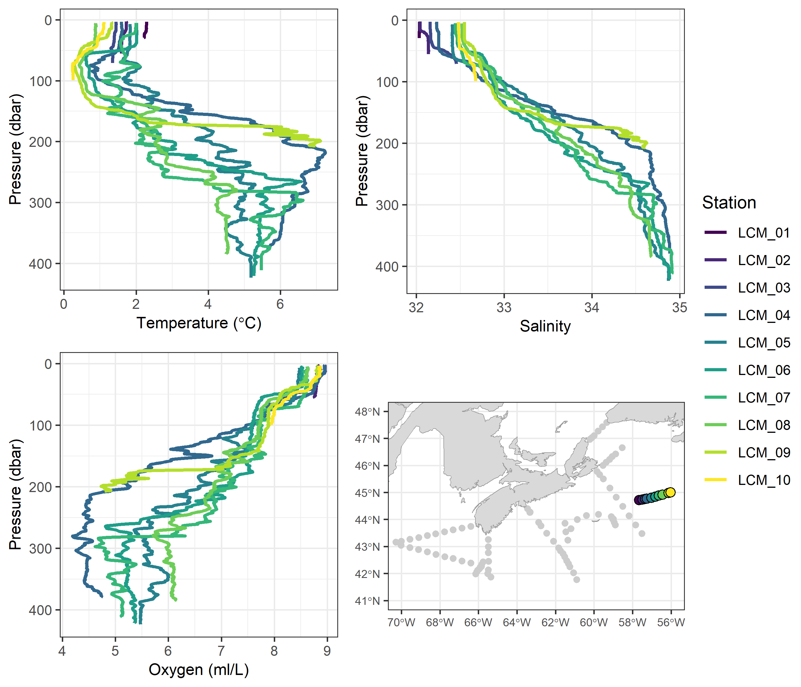

```
\clearpage

```{r figureA11, out.width="100%", fig.cap ="Vertical profiles of temperature (top left), salinity (top right), and dissolved oxygen (bottom left) from stations sampled on Sable Island Bank (SIB; bottom right) during the 2025 spring AZMP mission (EN728)."}

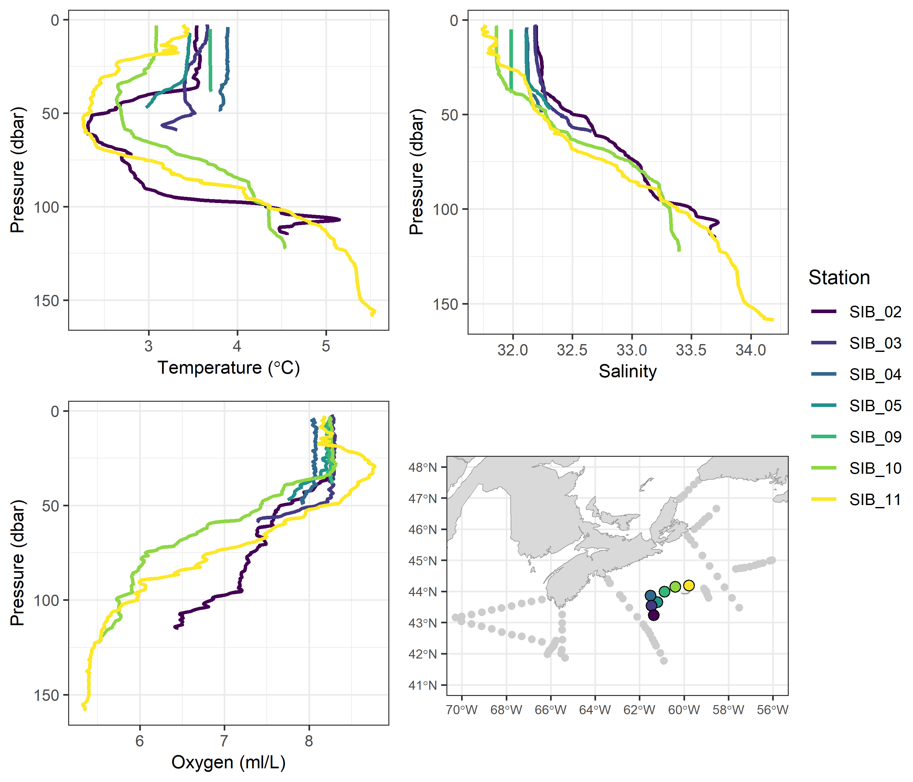

```
\clearpage

<!-- At the end of your appendices add: -->
`r if(knitr:::is_latex_output()) '% end csasdown appendix'`